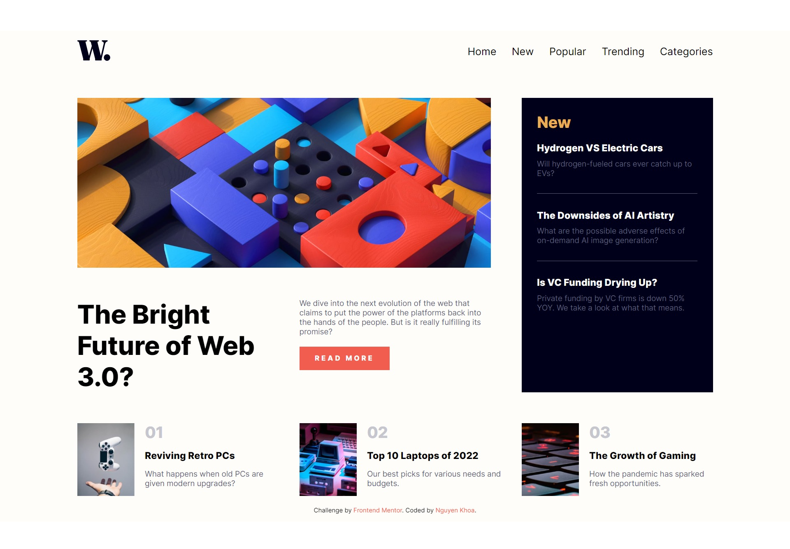
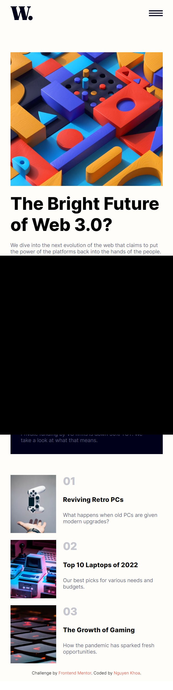

# Frontend Mentor - News homepage solution

This is a solution to the [News homepage challenge on Frontend Mentor](https://www.frontendmentor.io/challenges/news-homepage-H6SWTa1MFl). Frontend Mentor challenges help you improve your coding skills by building realistic projects.

## Table of contents

- [Overview](#overview)
  - [The challenge](#the-challenge)
  - [Screenshot](#screenshot)
  - [Links](#links)
- [My process](#my-process)
  - [Built with](#built-with)
  - [What I learned](#what-i-learned)
  - [Continued development](#continued-development)
- [Author](#author)

## Overview

### The challenge

Users should be able to:

- View the optimal layout for the interface depending on their device's screen size
- See hover and focus states for all interactive elements on the page

### Screenshot




### Links

- Solution URL: [https://github.com/NguyenVanKhoa-CDTH19PMC/news-homepage.git](https://github.com/NguyenVanKhoa-CDTH19PMC/news-homepage.git)
- Live Site URL: [https://nguyenvankhoa-cdth19pmc.github.io/news-homepage/](https://nguyenvankhoa-cdth19pmc.github.io/news-homepage)

## My process

### Built with

- Semantic HTML5 markup
- CSS custom properties
- CSS Grid
- JavaScript

### What I learned

Responsive layout grid

```css
main {
  display: grid;
  grid-template: auto auto / 1fr 1fr 1fr;
  gap: 60px;
}
#home-section {
  grid-column: 1/3;
}
```

### Continued development

Improve HTML, CSS and JavaScript skills

## Author

- Frontend Mentor - [@NguyenVanKhoa-CDTH19PMC] (https://www.frontendmentor.io/profile/NguyenVanKhoa-CDTH19PMC)
- Github - [NguyenVanKhoa-CDTH19PMC] (https://github.com/NguyenVanKhoa-CDTH19PMC)
